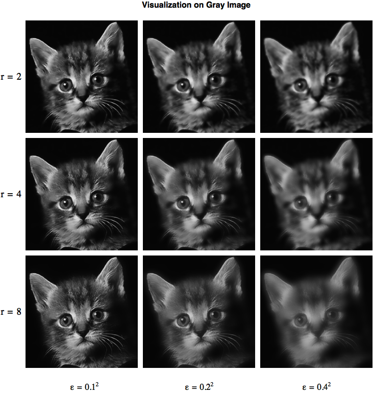
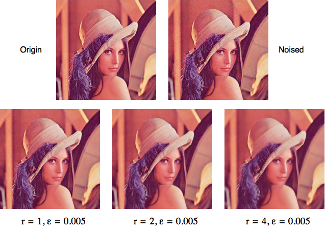

# Guided Filter
Simple Python implementation of paper:

    K.He, J.Sun, and X.Tang. Guided Image Filtering. TPAMI'12.
   
Guided filter is both effective and efficient in a great variety of computer
vision and computer graphics applications, including edge-aware smoothing,
detail enhancement, HDR compression, image matting/feathering, dehazing,
joint upsampling, etc.

## Visualization of results

Reimplementation of Figure 2 in paper and visualization on gray image.


And visualization on color image for denoising.


## Dependencies

This repository depends on Python modules listed below.
- numpy
- matplotlib
- opencv

If you want to run demo `main.py` by yourself, you have to install those modules in advance.
On the other hand, core of guided filter only depends on numpy, and you can check it for more.

## Usage

```python
from core.filter import GuidedFilter
# load your image
GF = GuidedFilter(image, radius, eps)
GF.filter(filtering_input)
```

### Demo
You can run demo for quick visualization on guided filter by
```bash
> python main.py
```

## License

The MIT License 2017 (c) Lisabug


